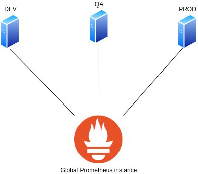
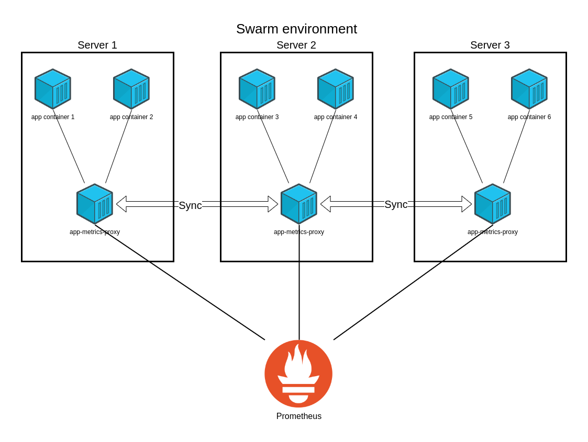

# App-metrics-proxy
App-metrics-proxy exporter helps you scrape prometheus metrics from other exporters and expose them under specified path and port.


## Use case
App-metrics-proxy exporter helps you to expose metrics from containers deployed in standalone, replicated or global modes. As term says, it is not a typcial exporter but just a proxy - created in order to scrape metrics from all available containers and expose them in Prometheus friendly way under the designated port which can be easily secured.

Thanks to app-metrics-proxy exporter you are able to create one, global Prometheus instance which is monitoring several swarm clusters, in multiple environments without exposing docker socket what might be the [vulnerability](https://docs.docker.com/engine/security/#docker-daemon-attack-surface) cause.

<p align="center">
    
    <figcaption align = "center"><b>Fig.1 - Monitoring multiple environments with Prometheus</b></figcaption>
</p>
 

## How does it work?
App-metrics-proxy exporter scans every container running on the node and looks for exposed metrics. If scanned address exists then exporter saves its metrics locally and exposes under specified path: */\<container name\>/metrics*. You can pass a few parameters to change its behaviour.

```yaml
version: "3.8"

services:
  app-metrics-proxy:
    image: luzblu3s/app-metrics-proxy
    environment:
      - SSHPASS=${SSHPASS}                # Required; ensure secure replication
      - SCRAPE_INTERVAL=15                # Optional; default 10
      - METRICS_PATH="/acurator/metrics"  # Optional; default /metrics
      - PORTS=4000                        # Optional; always scans :80, :8080 and :9100
    deploy:
      mode: global   
```
Above code snippet shows how to change default values. SSHPASS only is required as app-metrics-exporter replicates data between their tasks in swarm mode - this feature will be described later.
Every other parameter is optional, use them if you want to add additional ports, change path to scan or scrape interval.

## Swarm vs standalone containers
Exporter behavies differently depending on environment where it works. If app-metrics-proxy exporter was deployed as standalone container it just collects metrics from each container on the same node. 

However, in swarm environment it should be always deployed in global mode in order to collect metrics for each node. Because Prometheus is not able to recognize where service replicas currently are working, app-metrics-proxy synchronize data between each its instance hence Prometheus can easily reach out to any of them.

This behaviour inidicates a few issues which we should take into the consideration. For swarm services Docker will try to [load balance](https://docs.docker.com/engine/swarm/key-concepts/#load-balancing) Prometheus requests. It indicates problems when you want to scrape metrics for container deployed in replicated mode when number of replicas is less than number of nodes. In this scenario Prometheus requests won't be properly interpreted and you will receive instance down errors. To avoid it you need to [bypass ingress network](https://docs.docker.com/network/overlay/#bypass-the-routing-mesh-for-a-swarm-service).
Thanks that Prometheus requests will not be load balanced and you always reach out this app-metrics-exporter you want to.

```yaml
version: "3.8"

services:
  app-metrics-proxy:
    image: luzblu3s/app-metrics-proxy
    ports: 
      - published: 2137
        target: 2137
        mode: host            # Bypass ingress network, do not load balance traffic
    environment:
      - SSHPASS=${SSHPASS}    # To ensure secure replication ssh is used
    deploy:
      mode: global            # Monitor all nodes in swarm
```

## Repliciation
Replication is implemented with ssh and rsync commands. Every time when container finished collecting metrics from each container it synchronize their metrics with other services. Keep in mind only manager nodes are responsible for data replication. Moreover, containers deployed in global mode are not considered.

<p align="center">
    
    <figcaption align = "center"><b>Fig.2 - App-metrics-proxy replication</b></figcaption>
</p>

## Prometheus configuration
An example of Prometheus configuration for the service called *example-service* deployed as replica, exposing metrics which are scraped by app-metrics-proxy exporter. 

```yaml
  - job_name: 'example-service_dev'
    metrics_path: /example-service/metrics
    static_configs:
      - targets: ['server1.domain.local:2137','server2.domain.local:2137']
    relabel_configs:
      - source_labels: [job]
        target_label: job
        regex: "([^_]+)_+(.*)"
        replacement: $1
      - source_labels: [job]
        target_label: env
        regex: "([^_]+)_+(.*)"
        replacement: $2

  - job_name: 'example-service_qa'
    metrics_path: /example-service/metrics
    static_configs:
      - targets: ['server1.domain.local:2137','server2.domain.local:2137']
    relabel_configs:
      - source_labels: [job]
        target_label: job
        regex: "([^_]+)_+(.*)"
        replacement: $1
      - source_labels: [job]
        target_label: env
        regex: "([^_]+)_+(.*)"
        replacement: $2
```
